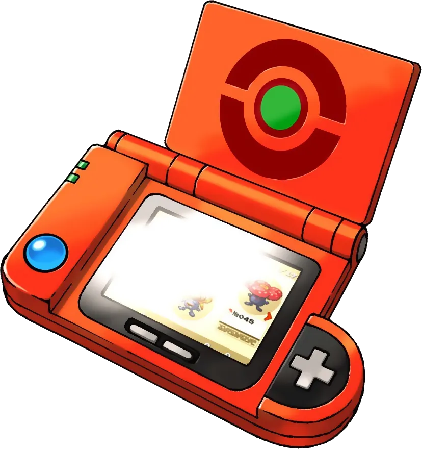

  

# 포켓몬 도감 with Server Side Rendering

CSR(Client-Side Rendering)으로 동작하는 React 포켓몬 도감 앱을 SSR(Server-Side Rendering)으로 전환합니다.

## ⛳️ 학습 목표

- CSR 앱의 초기 로딩 과정을 분석하고, SSR이 해결하는 문제가 무엇인지 설명할 수 있습니다.
- Vite 환경에서 서버 엔트리포인트와 클라이언트 엔트리포인트를 분리할 수 있습니다.
- `react-dom/server` API를 사용하여 서버에서 React 컴포넌트를 HTML로 변환할 수 있습니다.
- Hydration의 개념을 이해하고, 서버 HTML 위에 클라이언트 React를 연결할 수 있습니다.
- Hydration Mismatch가 발생하는 원인을 파악하고 해결할 수 있습니다.
- 서버에서 가져온 데이터를 클라이언트에 전달하여 동일한 초기 상태를 유지할 수 있습니다.
- 서버에서 요청 URL과 쿼리 파라미터를 해석하여 해당 페이지를 렌더링할 수 있습니다.

## 사전 준비

### 🎓 시작 전에 알아야 할 것들

- Express
- React Components
- React Router

## 💡 참고사항

- `/csr`이하 디렉터리를 참고하여 포켓몬 도감 앱이 동작하는 방식을 확인합니다.
  - 포켓몬 카드 목록이 표시됩니다.
  - 카드를 클릭하면 상세 페이지(`/pokemon/:id`)로 이동합니다.
  - 페이지네이션(`?page=2`)으로 다음 페이지의 포켓몬을 조회할 수 있습니다.

> [!NOTE]
> 본 미션에서 사용하는 [PokeAPI](https://pokeapi.co/)는 별도의 API 키 발급이 필요하지 않습니다.

### 현재 상태 관찰

SSR 전환을 시작하기 전에, 현재 CSR 앱의 동작을 관찰합니다.

1. 브라우저 개발자 도구의 **네트워크 탭**에서 첫 번째 HTML 응답의 내용을 확인합니다.
2. **Performance 탭**에서 페이지 로딩 과정을 녹화하고, 콘텐츠가 화면에 표시되기까지의 과정을 관찰합니다.
3. 브라우저 설정에서 **JavaScript를 비활성화**한 뒤 페이지를 새로고침하면 어떤 일이 일어나는지 확인합니다.

### 진행 방식

- 본 저장소를 fork하여 작업을 진행한다.
- Step별로 커밋을 분리하여, 전환 과정을 추적할 수 있도록 한다.
- 모든 Step을 완료한 후 PR을 올린다.
- 각 Step에 대한 정보는 `/steps` 디렉토리 하위에 문서로 존재한다.

### 환경 요구사항

- Node.js 20 이상
- npm 10 이상
